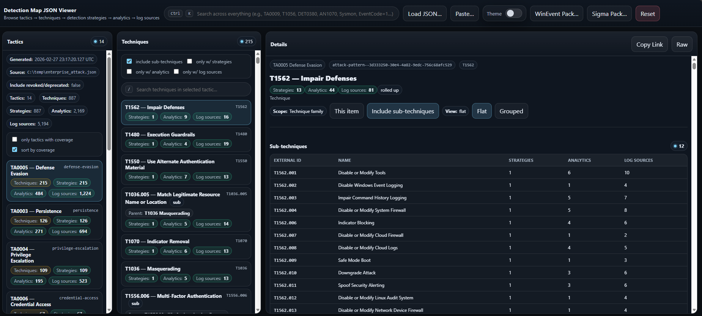
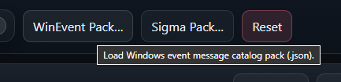
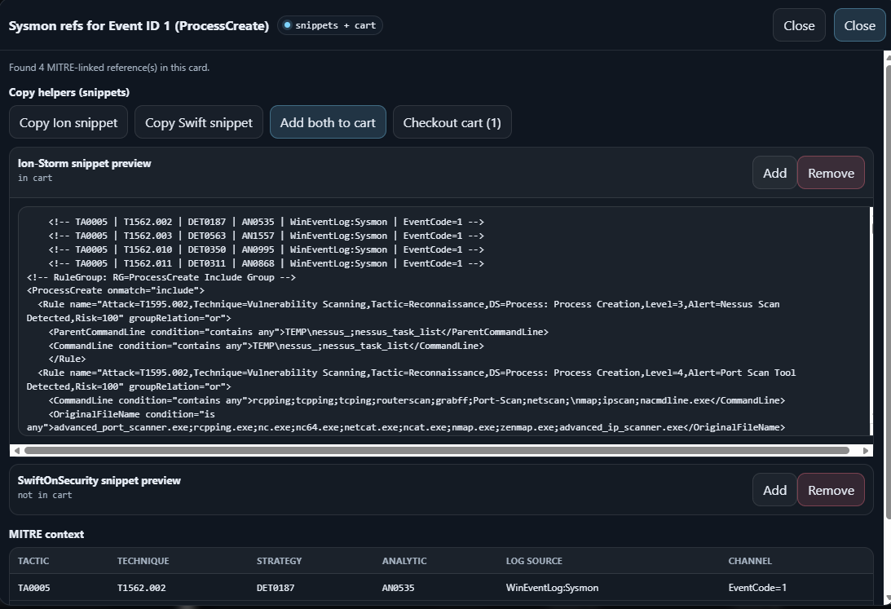
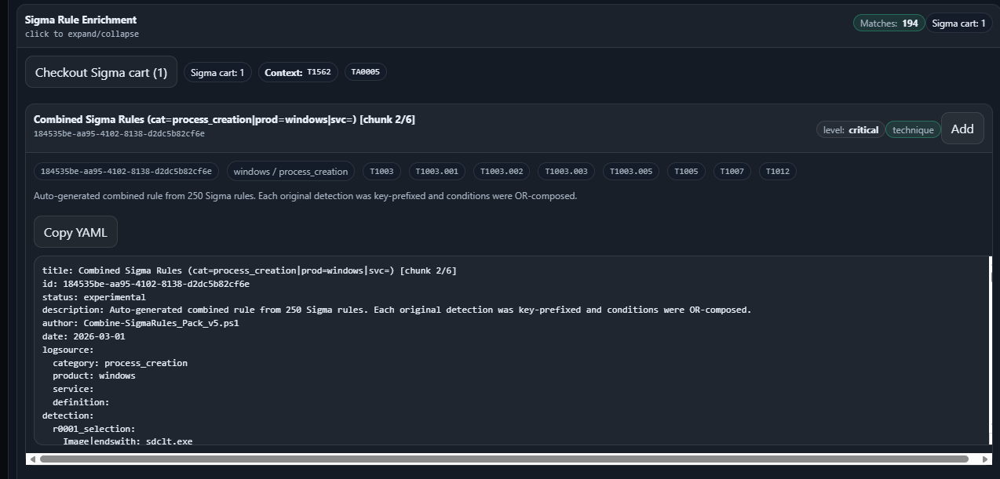
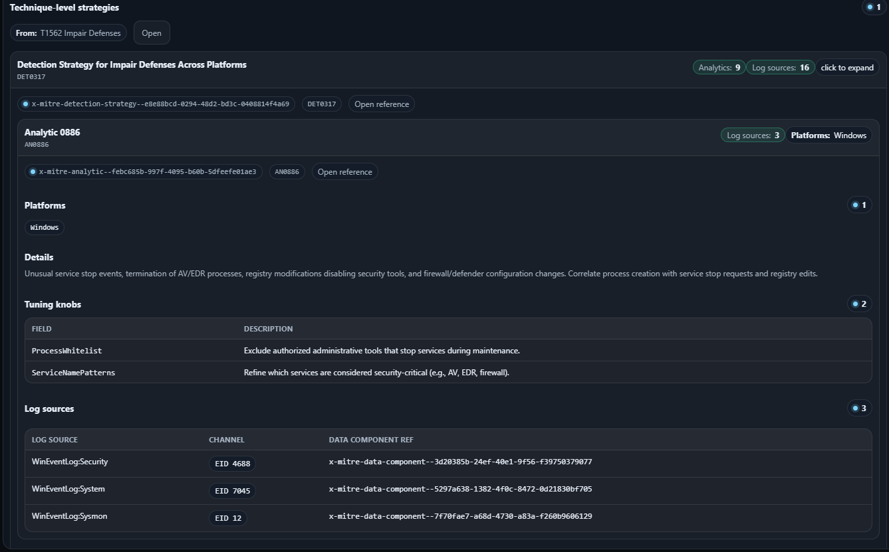
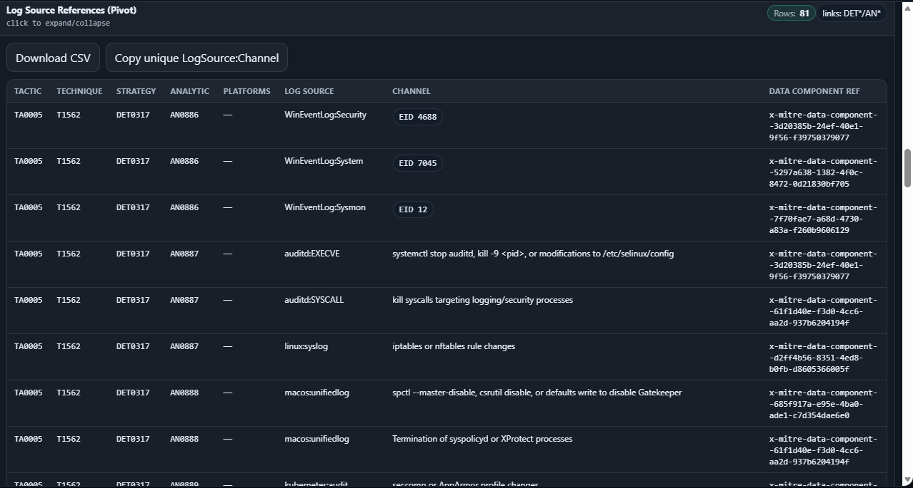
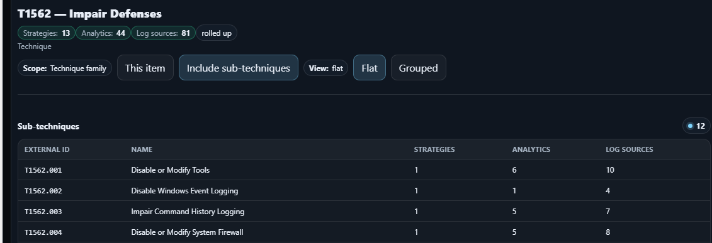
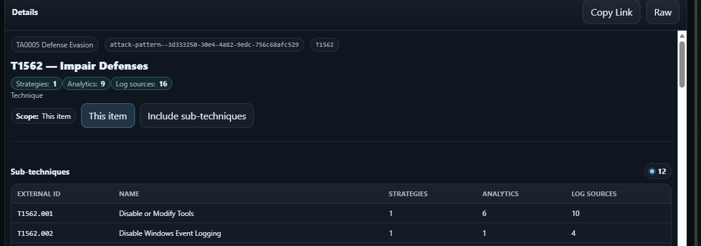
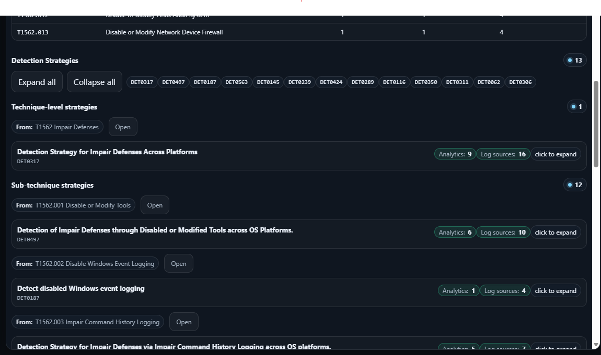
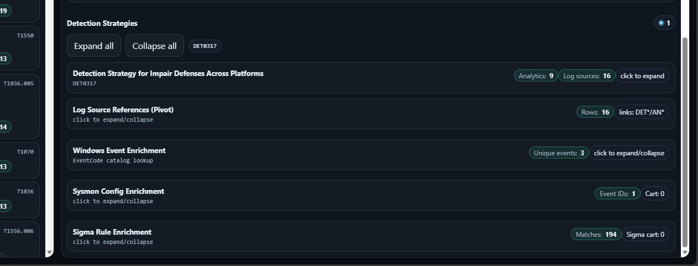

# detect-mapper-browser

A single-file, offline-capable HTML app for browsing a **MITRE ATT&CK “detection map”** in a nested structure:

**Tactic → Technique/Sub-technique → Detection Strategy → Analytic → Log Source Reference**

This repo also includes **optional enrichment packs** (Windows Event messages, Sysmon config snippets, Sigma rule packs) that turn “log source hints” into copy/pasteable artifacts.

---

## Quickstart

### 1) Start a local web server (required for `?src=`)

> You *can* open `detect-mapper-browser.html` directly, but `?src=...` and pack loading work best over HTTP.

**Python (recommended)**
```bash
cd detect-mapper-browser
python -m http.server 8080
```

**Node**
```bash
npx serve -l 8080 .
```

**Docker (no installs)**
```bash
docker run --rm -p 8080:80 -v "$PWD":/usr/share/nginx/html:ro nginx:alpine
```

Open: http://localhost:8080/detect-mapper-browser.html

### 2) or just launch the page in your favorite browser and go from there

---

## Load the detection map

You have two options:

### Option A — Auto-load via `?src=` (best UX)
1. Unzip the snapshot:
   - `mitre_deteciton_map/detection_map.zip` → `mitre_deteciton_map/detection_map.json`
2. Open:

```
http://localhost:8080/detect-mapper-browser.html?src=mitre_deteciton_map/detection_map.json
```

### Option B — Manual load
Click **Load JSON…** and pick a detection map JSON.

<a href="docs/screenshots/loaded_detection_map.png">
  
</a>

---

## How to browse

- Left: **Tactics** (sorted by coverage if enabled)
- Middle: **Techniques** (filters for “only with strategies/analytics/log sources”, include sub-techniques, and a per-tactic search)
- Right: **Details** pane with:
  - sub-technique list
  - “Detection Strategies” accordion
  - technique/sub-technique strategy cards
  - analytics + log source pivots

### Key UI shortcuts
- **Global search**: `Ctrl + K`
- **Copy Link**: copies a shareable deep-link (hash fragment) to the current selection
- **Raw**: shows the current node JSON payload (useful for debugging / exports)

---

## Feature index

The browser works with *just* the detection map. Everything below is optional, but worth it if you want to operationalize the log-source references.

<table>
  <tr>
    <td width="33%"><b>Windows Event Enrichment</b><br/>
      Map EventCode / provider hints to human-readable message templates.</br>
      Docs: <a href="windows_event_message_templates/README.md">windows_event_message_templates/</a>
    </td>
    <td width="33%"><b>Sysmon Config Enrichment</b><br/>
      Turn Sysmon Event IDs into config snippets (Ion-Storm / SwiftOnSecurity) and “cart” checkouts.</br>
      Docs: <a href="sysmon_enrichment/README.md">sysmon_enrichment/</a>
    </td>
    <td width="33%"><b>Sigma Rule Enrichment</b><br/>
      Load a combined Sigma pack and add matched rules to a cart for copy/export.</br>
      Docs: <a href="sigma_enrichment/README.md">sigma_enrichment/</a>
    </td>
  </tr>
  <tr>
    <td><a href="docs/screenshots/load_winmessages.png"></a></td>
    <td><a href="docs/screenshots/sysmon_added_to_cart.png"></a></td>
    <td><a href="docs/screenshots/sigmarule_added_to_cart.png"></a></td>
  </tr>
</table>

---

## What’s in this repo

- `detect-mapper-browser.html` — the viewer (single HTML file, includes JS/CSS)
- `mitre_deteciton_map/` — build scripts + snapshot packs for the detection map
- `windows_event_message_templates/` — build scripts + snapshot packs for WinEvent metadata/messages
- `sysmon_enrichment/` — Sysmon schema + baseline config references used by enrichment UI
- `sigma_enrichment/` — Sigma source packs + combiner script producing a single JSON pack
- `docs/screenshots/` — documentation screenshots used across READMEs

---

## Screenshot gallery (expand)

<details>
  <summary><b>Techniques, strategies, analytics, and pivots</b></summary>

  <a href="docs/screenshots/detection_strtegies_and_analytics.png">
    
  </a>

  <a href="docs/screenshots/logsources_linked_info.png">
    
  </a>
</details>

<details>
  <summary><b>Technique scope views (family vs this item)</b></summary>

  <a href="docs/screenshots/family_oriented.png">
    
  </a>

  <a href="docs/screenshots/selffocused.png">
    
  </a>

  <a href="docs/screenshots/familyfocused_options.png">
    
  </a>

  <a href="docs/screenshots/selffocused_options.png">
    
  </a>
</details>
