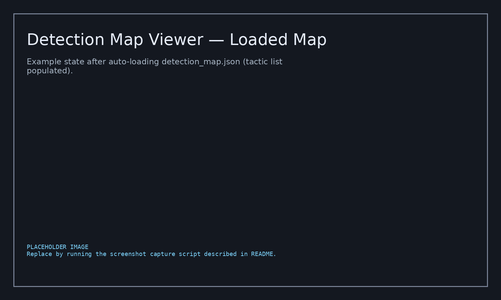
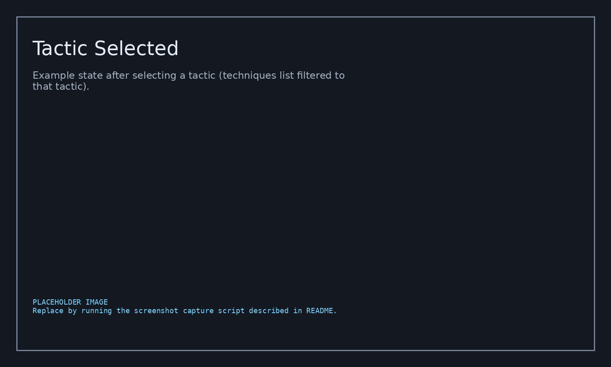
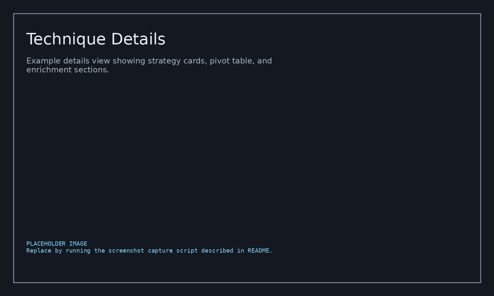

# MitreBrowser — Detection Map JSON Viewer

A single-file, offline-capable HTML app for browsing a **MITRE ATT&CK “detection map”** in a nested structure:

**Tactic → Technique/Sub-technique → Detection Strategy → Analytic → Log Source Reference**

This zip contains:

- `MitreBrowser/detect-mapper-browser.html` — the viewer (self-contained HTML/CSS/JS)
- `MitreBrowser/files/mitre_deteciton_map/detection_map.json` — example detection map dataset (prebuilt)
- Optional enrichment packs:
  - `MitreBrowser/files/sigma_enrichment/sigma.combined.pack.json` — Sigma rules pack (JSON)
  - `MitreBrowser/files/windows_event_message_templates/message.zip` (contains `message.json`) and `notemplate_message.json` — Windows event message catalog packs

> **Dataset stats (from the included `detection_map.json`):** 14 tactics, 250 techniques, 637 sub-techniques, 887 detection strategies, 2169 analytics, 5194 log-source references.

---

## Screenshots

> The images below are **placeholders** (generated in this environment).  
> Replace them by running the screenshot-capture steps in **“Generate real screenshots”**.







---

## Quickstart

### Option A — open directly (no server)

1. Open `detect-mapper-browser.html` in your browser (Chrome/Edge/Firefox).
2. Click **Load JSON…** (or drag & drop) and select:
   - `files/mitre_deteciton_map/detection_map.json`

This path uses the browser `FileReader`, so it works even from `file://`.

### Option B — run a tiny local web server (recommended)

Running a local server enables **auto-load** via `?src=...` and makes shareable links behave more predictably.

From the `MitreBrowser/` directory:

```bash
python -m http.server 8000
```

Open:

- `http://127.0.0.1:8000/detect-mapper-browser.html?src=files/mitre_deteciton_map/detection_map.json`

---

## Feature tour

### Navigation & filtering

- **3-pane layout**
  - **Tactics** (left): tactic list + counts
  - **Techniques** (middle): techniques/sub-techniques in the selected tactic
  - **Details** (right): strategy/analytic/log-source drill-down

- **Tactic filters**
  - *only tactics with coverage*
  - *sort by coverage*

- **Technique filters**
  - *include sub-techniques*
  - *only w/ strategies*
  - *only w/ analytics*
  - *only w/ log sources*

- **Coverage rollups** shown as badges:
  - Strategies / Analytics / Log sources

### Search

- **Global search (Ctrl+K / Cmd+K)** across IDs, names, channels
  - Press **Enter** to open results
  - Examples: `TA0009`, `T1056`, `DET0380`, `AN1070`, `Sysmon`, `EventCode=1`
- **Technique search (`/`)** focuses the technique search box in the selected tactic.
- Search results are clickable and **navigate** you to the matching tactic/technique/strategy/analytic/log-source.

### Details view

- **Scope switching**
  - **This item** (only the selected technique/sub-technique)
  - **Include sub-techniques / Technique family** (rolls up coverage)
  - Family view can be **Flat** or **Grouped**
- **Expand all / Collapse all** for strategy cards
- **Copy-on-click chips** for IDs:
  - Technique STIX id, external id (Txxxx)
  - Detection strategy ids (DET*)
  - Analytic ids (AN*)
  - Data component STIX refs

### Shareable links (hash routing)

The viewer updates the URL hash with:

- `t=<tactic-id>` (STIX id, not the external TA****)
- `k=<tech-key>` where tech-key is:
  - `tech:<technique-stix-id>` or
  - `sub:<parent-stix-id>:<subtechnique-stix-id>`

Use **Copy Link** in the Details panel to capture a shareable URL.

### Log source pivot + export

Under **Log Source References (Pivot)**:

- **Download CSV** (`logsource-pivot.csv`)
- **Copy unique LogSource:Channel**
- Clickable `DET*` / `AN*` values jump via the global search overlay.

### Windows Event enrichment (optional pack)

Click **WinEvent Pack…** and load a Windows event catalog JSON.

Included options:

- `files/windows_event_message_templates/notemplate_message.json` (large; includes many events but templates may be empty)
- `files/windows_event_message_templates/message.zip` → unzip to `message.json` and load that

When loaded:
- Event ID tokens in channels (e.g., `EventCode=4688`) become clickable chips.
- Clicking an Event ID opens a modal with the provider/event metadata (and template/message when available).

### Sysmon enrichment (built-in)

The HTML embeds:

- A Sysmon manifest (schema reference)
- Two Sysmon config “profiles” (Ion-Storm + SwiftOnSecurity) as snippet sources

Features:
- Detects Sysmon log sources and parses Event IDs from `EventCode=...`
- Click an **EID chip** to open schema details
- **Sysmon snippet cart**
  - add/remove snippets per Event ID
  - **Checkout & download** generates complete Sysmon config wrappers (`sysmon-checkout.<profile>.xml`)

### Sigma enrichment (optional pack)

Click **Sigma Pack…** and load:

- `files/sigma_enrichment/sigma.combined.pack.json`

Features:
- Matches Sigma rules to the currently selected tactic/technique context
- **Sigma cart**
  - add/remove matched rules
  - **Checkout & download** exports a multi-document YAML bundle (`sigma-cart.yml`)

### Quality-of-life

- **Theme toggle** (light/dark)
- **Reset** button to clear state
- **Esc** closes modals

---

## Generate real screenshots

This repo includes placeholder images under `docs/screenshots/`.  
To generate real UI screenshots on your workstation, here are two practical approaches.

### Approach 1 — Playwright (recommended)

1. From `MitreBrowser/`, start a local server:

```bash
python -m http.server 8000
```

2. Install Playwright (Node.js):

```bash
npm init -y
npm i -D playwright
npx playwright install chromium
```

3. Create `tools/capture_screenshots.mjs`:

```js
import { chromium } from "playwright";
import fs from "node:fs";

const base = "http://127.0.0.1:8000/detect-mapper-browser.html?src=files/mitre_deteciton_map/detection_map.json";
const outDir = "docs/screenshots";
fs.mkdirSync(outDir, { recursive: true });

const shots = [
  { name: "01_loaded.png", url: base },
  { name: "02_tactic_selected.png", url: base + "#t=x-mitre-tactic--78b23412-0651-46d7-a540-170a1ce8bd5a" },
  {
    name: "03_technique_details.png",
    url: base + "#t=x-mitre-tactic--78b23412-0651-46d7-a540-170a1ce8bd5a&k=tech%3Aattack-pattern--3d333250-30e4-4a82-9edc-756c68afc529"
  },
];

(async () => {
  const browser = await chromium.launch();
  const page = await browser.newPage({ viewport: { width: 1500, height: 900 } });

  for (const s of shots) {
    await page.goto(s.url, { waitUntil: "networkidle" });
    await page.waitForTimeout(1500);
    await page.screenshot({ path: `${outDir}/${s.name}`, fullPage: true });
    console.log("wrote", s.name);
  }

  await browser.close();
})();
```

4. Run:

```bash
node tools/capture_screenshots.mjs
```

### Approach 2 — Manual OS screenshots

1. Open the viewer (Option A or B above).
2. Capture:
   - loaded state
   - a tactic selected
   - a technique details view with pivot/enrichment visible
3. Save as:
   - `docs/screenshots/01_loaded.png`
   - `docs/screenshots/02_tactic_selected.png`
   - `docs/screenshots/03_technique_details.png`

---

## Rebuilding the data assets (PowerShell)

### Rebuild `detection_map.json` (MITRE ATT&CK Enterprise STIX → nested map)

Scripts are under `files/mitre_deteciton_map/`.

1. Download the Enterprise ATT&CK bundle:

- `get-mitreEnterpriseData.ps1` downloads a pinned bundle to `c:\temp\enterprise_attack.json`.

2. Build the nested detection map:

- `build_detection_map.ps1` reads an `enterprise_attack.json` or `.zip` and emits `detection_map.json`.

Example:

```powershell
# From files\mitre_deteciton_map\
.\build_detection_map.ps1 -In c:\temp\enterprise_attack.json -Out .\detection_map.json
```

Optional flags:
- `-IncludeRevokedDeprecated`
- `-IncludeObjectFields`

### Build a Sigma JSON pack

`files/sigma_enrichment/Combine-SigmaRules.ps1` combines Sigma YAML rules into a single JSON “pack”.

Requirements:
- PowerShell 7+ recommended (parallel YAML parsing)
- `powershell-yaml` module

Example:

```powershell
Install-Module powershell-yaml -Scope CurrentUser
.\Combine-SigmaRules.ps1 -InputPath .\sigma_all_rules.zip, .\sigma-master.zip -OutputDir .\out
```

### Build a Windows Event message catalog pack

`files/windows_event_message_templates/get-providerMessages.ps1` enumerates provider metadata.

Notes:
- `#Requires -RunAsAdministrator`
- The output is designed to match what Event Viewer / `Get-WinEvent` shows.

---

## Repo layout

```text
MitreBrowser/
  detect-mapper-browser.html
  files/
    mitre_deteciton_map/
      detection_map.json
      build_detection_map.ps1
      get-mitreEnterpriseData.ps1
      enterprise_attack.zip
    sigma_enrichment/
      sigma.combined.pack.json
      Combine-SigmaRules.ps1
      sigma-master.zip
      sigma_all_rules.zip
    windows_event_message_templates/
      message.zip          # contains message.json
      notemplate_message.json
      get-providerMessages.ps1
```

---

## Notes / troubleshooting

- **Large JSON**: use **Load JSON…** or drag&drop; pasting into the modal can be slow for multi-MB payloads.
- **Auto-load** requires HTTP(s): `?src=...` uses `fetch()`, which browsers block for `file://` URLs.
- **Nothing shows after loading**: confirm the JSON has the expected nested fields:
  `tactics → techniques → x_mitre_detection_strategies → x_mitre_analytics → x_mitre_log_source_references`.
