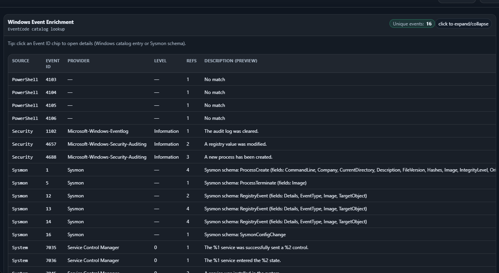
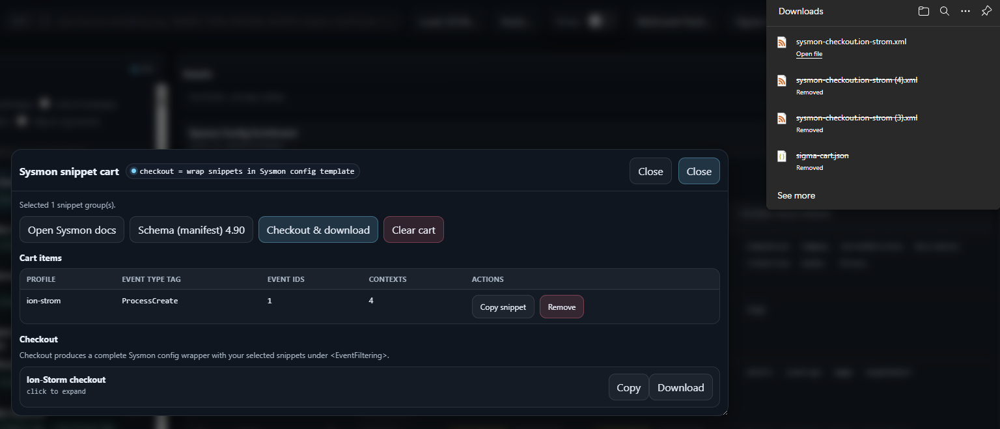

# MitreBrowser — Detection Map JSON Viewer

A single-file, offline-capable HTML app for browsing a **MITRE ATT&CK “detection map”** in a nested structure:

**Tactic → Technique/Sub-technique → Detection Strategy → Analytic → Log Source Reference**

This zip contains:

- `MitreBrowser/detect-mapper-browser.html` — the viewer (self-contained HTML/CSS/JS)
- `MitreBrowser/files/mitre_deteciton_map/detection_map.json` — example detection map dataset (prebuilt)
- Optional enrichment packs:
  - `MitreBrowser/files/sigma_enrichment/sigma.combined.pack.json` — Sigma rules pack (JSON)
  - `MitreBrowser/files/windows_event_message_templates/message.zip` (contains `message.json`) and `notemplate_message.json` — Windows event message catalog packs

> **Dataset stats (from the included `detection_map.json`):** 14 tactics, 250 techniques, 637 sub-techniques, 887 detection strategies, 2169 analytics, 5194 log-source references.

---

## Screenshots

These screenshots were captured from a real run of the viewer and map directly to the feature walkthrough below.








---

## Quickstart

### Option A — open directly (no server)

1. Open `detect-mapper-browser.html` in your browser (Chrome/Edge/Firefox).
2. Click **Load JSON…** (or drag & drop) and select:
   - `files/mitre_deteciton_map/detection_map.json`

This path uses the browser `FileReader`, so it works even from `file://`.

### Option B — run a tiny local web server (recommended)

Running a local server enables **auto-load** via `?src=...` and makes shareable links behave more predictably.

From the `MitreBrowser/` directory:

```bash
python -m http.server 8000
```

Open:

- `http://127.0.0.1:8000/detect-mapper-browser.html?src=files/mitre_deteciton_map/detection_map.json`

---

## Feature tour

### Navigation & filtering

- **3-pane layout**
  - **Tactics** (left): tactic list + counts
  - **Techniques** (middle): techniques/sub-techniques in the selected tactic
  - **Details** (right): strategy/analytic/log-source drill-down

- **Tactic filters**
  - *only tactics with coverage*
  - *sort by coverage*

- **Technique filters**
  - *include sub-techniques*
  - *only w/ strategies*
  - *only w/ analytics*
  - *only w/ log sources*

- **Coverage rollups** shown as badges:
  - Strategies / Analytics / Log sources


### Search

- **Global search (Ctrl+K / Cmd+K)** across IDs, names, channels
  - Press **Enter** to open results
  - Examples: `TA0009`, `T1056`, `DET0380`, `AN1070`, `Sysmon`, `EventCode=1`
- **Technique search (`/`)** focuses the technique search box in the selected tactic.
- Search results are clickable and **navigate** you to the matching tactic/technique/strategy/analytic/log-source.

### Details view

- **Scope switching**
  - **This item** (only the selected technique/sub-technique)
  - **Include sub-techniques / Technique family** (rolls up coverage)
  - Family view can be **Flat** or **Grouped**
- **Expand all / Collapse all** for strategy cards
- **Copy-on-click chips** for IDs:
  - Technique STIX id, external id (Txxxx)
  - Detection strategy ids (DET*)
  - Analytic ids (AN*)
  - Data component STIX refs


### Shareable links (hash routing)

The viewer updates the URL hash with:

- `t=<tactic-id>` (STIX id, not the external TA****)
- `k=<tech-key>` where tech-key is:
  - `tech:<technique-stix-id>` or
  - `sub:<parent-stix-id>:<subtechnique-stix-id>`

Use **Copy Link** in the Details panel to capture a shareable URL.

### Log source pivot + export

Under **Log Source References (Pivot)**:

- **Download CSV** (`logsource-pivot.csv`)
- **Copy unique LogSource:Channel**
- Clickable `DET*` / `AN*` values jump via the global search overlay.


### Windows Event enrichment (optional pack)

Click **WinEvent Pack…** and load a Windows event catalog JSON.

Included options:

- `files/windows_event_message_templates/notemplate_message.json` (large; includes many events but templates may be empty)
- `files/windows_event_message_templates/message.zip` → unzip to `message.json` and load that

When loaded:
- Event ID tokens in channels (e.g., `EventCode=4688`) become clickable chips.
- Clicking an Event ID opens a modal with the provider/event metadata (and template/message when available).


### Sysmon enrichment (built-in)

The HTML embeds:

- A Sysmon manifest (schema reference)
- Two Sysmon config “profiles” (Ion-Storm + SwiftOnSecurity) as snippet sources

Features:
- Detects Sysmon log sources and parses Event IDs from `EventCode=...`
- Click an **EID chip** to open schema details
- **Sysmon snippet cart**
  - add/remove snippets per Event ID
  - **Checkout & download** generates complete Sysmon config wrappers (`sysmon-checkout.<profile>.xml`)


### Sigma enrichment (optional pack)

Click **Sigma Pack…** and load:

- `files/sigma_enrichment/sigma.combined.pack.json`

Features:
- Matches Sigma rules to the currently selected tactic/technique context
- **Sigma cart**
  - add/remove matched rules
  - **Checkout & download** exports a multi-document YAML bundle (`sigma-cart.yml`)


### Quality-of-life

- **Theme toggle** (light/dark)
- **Reset** button to clear state
- **Esc** closes modals

---

## Updating screenshots

Screenshots referenced by this README live under `docs/screenshots/`. To update the visuals, overwrite the image files in that folder (keep the same filenames so links don’t break).

**Files referenced in this README**

- `loaded_detection_map.png` — viewer loaded (3-pane layout)
- `selffocused.png` — “This item” scope view
- `selffocused_options.png` — technique-level strategies with enrichment panels visible
- `family_oriented.png` — “Technique family” scope rollup
- `familyfocused_options.png` — family scope controls (flat/grouped, include sub-techniques, etc.)
- `detection_strtegies_and_analytics.png` — detection strategy + analytic details (tuning knobs + log sources)
- `logsources_linked_info.png` — log-source pivot table + export actions
- `load_winmessages.png` — WinEvent pack loader UI
- `family_detect_winEID_strats.png` — Windows Event enrichment + Sysmon/Sigma sections
- `sysmon_added_to_cart.png` — Sysmon enrichment table (add to cart)
- `family_sysmon_config_generator_ralated_references.png` — Sysmon refs modal (snippets + cart)
- `checkout_sysmon_cart.png` — Sysmon snippet cart checkout/download
- `load_sigmarules.png` — Sigma pack loader UI
- `sigmarule_added_to_cart.png` — Sigma enrichment (rules list)
- `family_sigma_rulepack_generator_ralated_references.png` — Sigma rule details + YAML payload
- `checkout_sigma_cart.png` — Sigma cart checkout/download

### Manual capture (fastest)

1. Open the viewer (see **Quickstart** above).
2. Navigate to the state you want to capture (tactic/technique, pivot table, enrichment panels, carts).
3. Use your OS screenshot tool.
4. Save into `docs/screenshots/` using the filenames above.

### Automated capture (optional)

If you’re using the Docker + Playwright runner (from the companion kit), you can re-run:

```bash
docker compose run --rm shots
```

and it will overwrite the images under `docs/screenshots/`.
