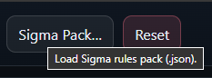
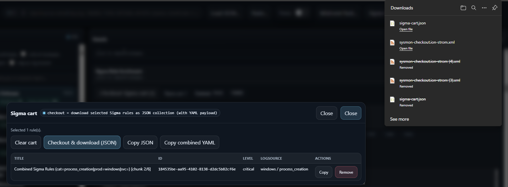
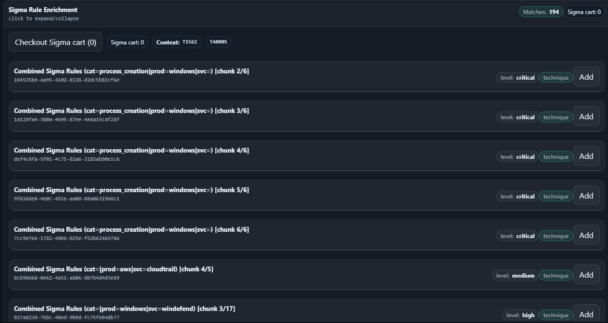

# Sigma enrichment

Sigma enrichment lets the viewer load a **combined Sigma pack** (JSON) and match Sigma rules against the current
MITRE context (technique, sub-technique, strategy, analytic). You can then add rules to a cart and export them as JSON
(with YAML payload).

---

## Use in the browser

1. Load a detection map JSON in the viewer.
2. Click **Sigma Pack…** and load a combined pack JSON (typically `sigma.combined.pack.json`).

<a href="../docs/screenshots/load_sigmarules.png">
  
</a>

3. Navigate to a technique and expand **Sigma Rule Enrichment**.
4. Click **Add** on a rule to add it to the cart.

<a href="../docs/screenshots/sigmarule_added_to_cart.png">
  
</a>

### Checkout / export

Open the Sigma cart and export:

<a href="../docs/screenshots/checkout_sigma_cart.png">
  
</a>

### Reference drill-down

Rules and exports preserve MITRE context and related references:

<a href="../docs/screenshots/family_sigma_rulepack_generator_related_references.png">
  
</a>

---

## Build a combined Sigma pack

Script: `Combine-SigmaRules.ps1`

High-level behavior:
- accepts one or more input paths (`-InputPath`) pointing to ZIPs/folders
- parses YAML Sigma rules (PowerShell 7+ supports parallel parsing)
- groups/combines rules by log source and emits a single JSON pack

Example:
```powershell
pwsh ./sigma_enrichment/Combine-SigmaRules.ps1 `
  -InputPath ./sigma_enrichment/sigma_all_rules.zip,./sigma_enrichment/sigma-master.zip `
  -OutputDir ./sigma_enrichment/out `
  -OutputPackFile sigma.combined.pack.json `
  -ThrottleLimit 12
```

Optional switches:
- `-WriteYamlBundle`
- `-WriteYamlFiles`
- `-WriteManifestJson`

---

## Notes

- If you see “Matches: 0”, ensure you have a technique selected and that your Sigma pack includes relevant logsource categories.
- The combined-rule “chunks” are expected when many rules share the same logsource; the UI surfaces them as grouped entries.
