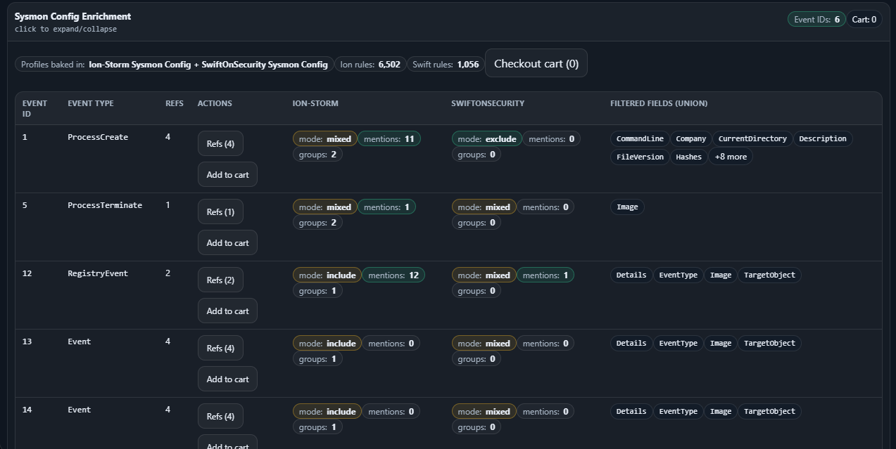

# Sysmon enrichment

Sysmon enrichment turns Sysmon-related log source references into **concrete Sysmon Event IDs**, schema hints,
and **config snippet exports** (Ion-Storm + SwiftOnSecurity). The UI includes a “cart” to assemble multiple
snippets and checkout as a wrapped Sysmon configuration.

This folder holds:
- baseline config references (`configs/`)
- schema/template material (`schema/`)

---

## Use in the browser

1. Load a detection map JSON in the viewer.
2. Navigate to a technique/strategy that includes Sysmon-relevant log sources.
3. Expand **Sysmon Config Enrichment**.
4. Use **Refs** to open reference details; use **Add to cart** to collect snippets.

### Checkout (download / copy)

Open the cart and checkout:

### Reference drill-down

The enrichment cards link back to MITRE context (tactic/technique/strategy/analytic/log source):

---

## What’s inside

- `configs/` — pointers and exports for baseline Sysmon configs (Ion-Storm, SwiftOnSecurity).
- `schema/` — schema notes + XML wrapper templates used for cart checkouts.

See:
- `configs/README.md`
- `schema/README.md`

---

## Practical tips

- Start with the “ProcessCreate” and “RegistryEvent” rows to understand how field coverage differs per baseline profile.
- Use the cart checkout output as a *starting point* — you still need to tailor includes/excludes to your environment.
